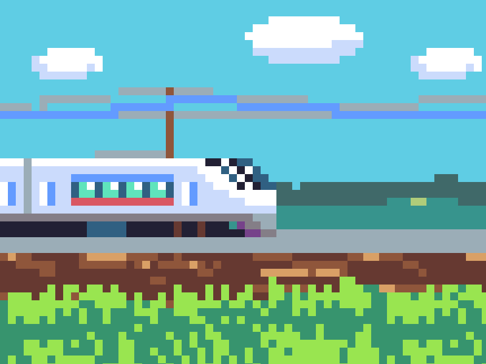

<h1>Autores: Cauã Magalhães e Erick Galvez</h1>

# Jogo Trem das Onze
Este é um jogo simples chamado "Trem das Onze", onde o jogador controla um personagem para evitar colisões com obstáculos, para não perder o trem.

# Estrutura HTML
div class="game": É o canvas principal que abriga o jogo.

div class="carinha": Representa o personagem do jogo.

div class="alvo": Representa o obstáculo que o jogador deve evitar.

div class="score": Mostra a pontuação atual.

div class="game-over": Exibe a mensagem "Perdeu o trem!" e o botão para tentar novamente.

# CSS

body: Define o estilo para o corpo da página, como cor de fundo.

.carinha e .alvo**: Estiliza o personagem e o obstáculo com imagens e posicionamento.

.score: Estiliza a exibição da pontuação.

.game-over: Estiliza a tela de "Perdeu o trem!".

# JavaScript

movecarinha(e):Move o personagem esquerda/direita conforme as setas do teclado.

jump(e): Faz o personagem pular quando a barra de espaço é pressionada.

movealvo(): Move o obstáculo na tela.

checkCollision(): Verifica se houve colisão entre o personagem e o obstáculo.

gameOver(): Exibe a tela de "Perdeu o trem!" quando há colisão.

restartGame(): Reinicia o jogo após o término.

<h1>Capturas de Tela e Imagens usadas</h1>

Derrota. 

Salto e Pontuação. 

Carinha. 

Alvo. 

Tela de fundo. 

